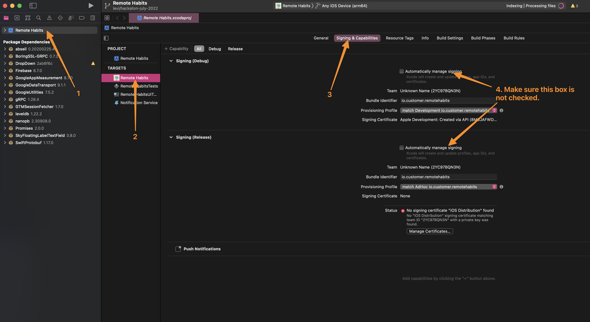
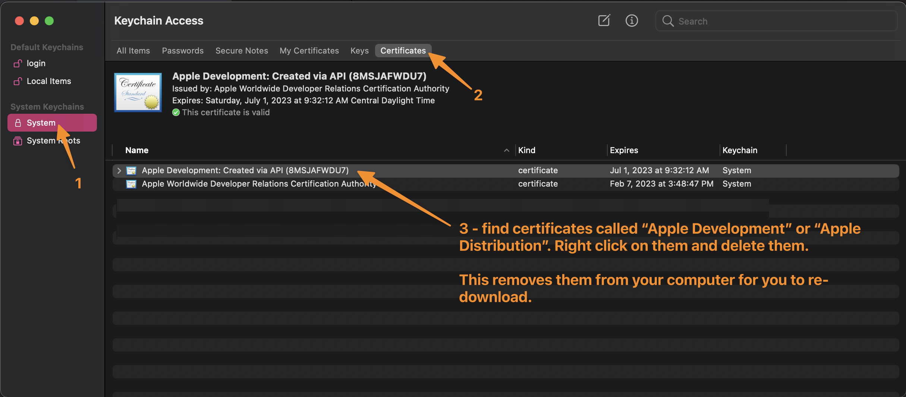

# iOS Code Signing

After you compile an iOS app, you must have it signed before the app can be installed on a device. iOS code signing is a security measure put in place to make sure that an app was compiled by Customer.io and not modified by anyone else. Signing binaries is common in other technologies but something that makes iOS code signing unique is that you sign a binary with a specific installation method in mind. So, if you sign an app in development mode, you can only install that app on the 1 development device the binary was signed for. If you sign an app for the Apple App Store, the app can only be installed by a device that dowloaded the app from the App Store. 

# What do you need to sign an iOS app? 

Code signing is done during the compilation process. Either in Xcode IDE or on the CI server using `xcodebuild` CLI. As long as the Xcode iOS project is configured correctly with the signing files to use, signing will be done for you. 

To perform iOS code signing, you need to have **a certificate** and **a provisioning profile**. Apple issues these files to you which means that you need to use an Apple Developer Account to have these files created. After they are created, you download the files to your computer (or to the CI server) and signing can be done. 

# How we manage code signing files on this team

If you were to ask an iOS engineer about code signing, you might feel some sense of frustration. Code signing can add some complexity to a team with the problems that it can bring. Anytime that a new engineer joins your team, they need to install the code signing files on their machine and get Xcode working. When you want to test an app on a new iOS device, a new provisioning profile needs to be created to include this new device. Certificates expire and need to be re-created. It can be a fragile process and feel like a pain. 

To help make this process easier, we use a tool called [fastlane match](https://docs.fastlane.tools/actions/match/). How match works is that we create a certificate and provisioning profile through Apple's Developer Account for code signing. Then, we upload these files a private cloud file hosting service (specifically a Google Cloud bucket). Then, each member of our team and the CI server downloads the code signing files. Team members do not even need an Apple Developer Account to get the code signing files to compile an iOS app! 

# How do I setup my computer for code signing? 

1. Before we download the code signing files, let's check a couple of settings that commonly break code signing for the team. Xcode has the power of overwriting files in the Apple Developer Account if the Xcode settings are setup to do that. We want to avoid doing that. 

   * Open the iOS Xcode project. Open:`"Xcode" menu item by the Apple logo on your computer > Preferences > Accounts`. Make sure that your *not* logged into your `@customer.io` Apple Developer Account (if you have one). 

   * Make sure that "Automatically manage signing" is *not* enabled by following these steps:

   

2. Find file `gc_keys.json` inside of 1Password for the iOS app that you're working on. Each iOS app in the company has it's own file. Download this file to the root directory of your iOS project. 

   You know if you put the file in the correct place if you run `git status` on the iOS project and you do not see `gc_keys.json` listed. This file is *not* inside of the version control for iOS projects. 

3. Install the CLI tool [fastlane](https://docs.fastlane.tools/getting-started/ios/setup/#installing-fastlane) to your computer. It's highly recommended to use the `gem install` method as other install methods have caused issues in the past.

4. Run `fastlane ios dev_setup` in the root directory of the iOS project. Fastlane should *not* ask you to login to your Apple or Google account (because of the files you downloaded from 1Password). Instead, it should  simply download the provisioning profile and certificates and give you a success message:

4. Exit and reopen the project in Xcode. Then check to make sure there are no errors in the code signing settings:

If you see errors inside of Xcode, follow the troubleshooting section in this document to help you find a solution. 

# Troubleshooting 

Having a problem? Hopefully something in this section helps you out. If not, ask the iOS engineers for help. Add your question and answer to this document to help others in the future! 

## Xcode says "No signing certificate _____ found" or "Provisioning profile ______ doesn't include signing certificate _______"

These error messages are common and are fixed in a few ways. Either you need to reload Xcode for it to find the correct files or delete some files on your computer and try again to install the correct files. 

1. Quit Xcode (⌘Q), re-open Xcode, open the Xcode project again. Check to see if the error is still showing up. Sometimes Xcode needs to re-load the code signing files on your computer and the errors go away. 

   If that doesn't work, continue to the next step. 

2. Open Keychain Access program on your computer. Follow these instructions to find and delete your existing certificates on your computer. If you do not find any, it's OK. 
   

3. Follow the instructions in this document for [*How do I setup my computer for code signing?*](#how-do-I-setup-my-computer-for-code-signing) 

If these instructions didn't work for you, it might be a good time to ask one of your team members to try all of these steps, too. Have them delete their old certificate and re-download them and see if they are seeing the same errors. This is a good idea to see if the code signing files are still valid but your computer is the issue. Re-creating the code signing files has some drawbacks some it's good to try other methods to fix the problem first. 

If you and your team members are seeing these errors, that could mean that you need to delete the existing code signing files and re-create them. Follow the instructions in this document for [*Reset code signing documents*](#reset-code-signing-documents). 

# Reset code signing documents 

Certificate files expire (the program *Keychain Access* on your computer tells you when they expire). Sometimes a code signing file gets accidentally deleted. In these scenarios, it's a good idea to reset code signing documents by deleting all of the existing ones and creating new ones. 

Before you do a reset, know some of the problems when resetting code signing documents

* Deleting code signing documents might make all of the engineers on the team to have their Xcode environment broken and they need to download the newest code signing files. This is a quick process, but it still loses productivity so limiting how often engineers have to do this is good. 
* When code signing documents are deleted, it means that all previous builds of the iOS app that were signed with those documents will no longer be able to be installed on a device. Builds need to be re-compiled and signed with the new code signing documents. This could mean that the QA team and others will need new builds of the app created for testing. Again, not a big issue, but still lose of productivity so limiting how often this happens is good. 

Now, let's get into how to reset code signing documents. 

As stated in this document, we use [fastlane match](https://docs.fastlane.tools/actions/match/) to create code signing documents and upload them to a private cloud storage location. We will be using fastlane match to:

1. Delete the code signing documents in the private cloud storage (Google Cloud S3 bucket). 
2. Delete the code signing documents from our company Apple Developer Account. 
3. Create new code signing documents in the company Apple Developer Account. 
4. Upload these new code signing documents in the private cloud storage (Google Cloud S3 bucket). 

Follow these instructions:

1. Find file `app_store_connect_creds.json` inside of 1Password. All iOS apps use the same file so there is only 1 of these files in 1Password. Download this file to the root directory of your iOS app. 

   Find file `gc_keys.json` inside of 1Password for the iOS app that you're working on. Each iOS app in the company has it's own file. Download this file to the root directory of your iOS project. 

   You know if you put the file in the correct place if you run `git status` on the iOS project and you do not see `gc_keys.json` or  `app_store_connect_creds.json` listed. These files are *not* inside of the version control for iOS projects. 

2. Install the CLI tool [fastlane](https://docs.fastlane.tools/getting-started/ios/setup/#installing-fastlane) to your computer. It's highly recommended to use the `gem install` method as other install methods have caused issues in the past.

3. Run `fastlane ios delete_code_signing` in the root directory of the iOS project. Fastlane should *not* ask you to login to your Apple or Google account (because of the files you downloaded from 1Password). It might ask you about what files to delete and to confirm the deletion before doing it. You should see fastlane give you a successful message saying that files have been deleted for your iOS app. 

4. Run `fastlane ios create_code_signing` in the root directory of the iOS project. Fastlane should *not* ask you to login to your Apple or Google account (because of the files you downloaded from 1Password). Fastlane should give you a successful message saying that files have been created. 

That's it! The CI server should work without any changes. It should download the new files the next time that it builds the iOS app. However, it would be nice to send a message to all the iOS engineers saying that code signing documents have been re-created so they can follow the instructions  [*How do I setup my computer for code signing?*](#how-do-I-setup-my-computer-for-code-signing) again to download the new files. 

# How does the CI server work? 

The CI server compiles and signs iOS apps for our team. Just like you do on Xcode. 

The CI server uses [fastlane match](https://docs.fastlane.tools/actions/match/) to download the existing code signing files from the private cloud hosting. The one thing that makes the CI server configuration unique is that every time that the CI server runs, it will update *the provisioning profile* (not code signing certificate) automatically if it determines that there have been new iOS test devices registered to the company Apple Developer Account. Each time that you make an *adhoc* build of an iOS app, you specify exactly what devices can install that app build. You cannot add new devices to a previous build of an iOS app. This can be annoying but luckily because the CI server takes care of updating the code signing files automatically before each build, we can feel confident that every time that the iOS app is built, every test device currently registered to the Apple Developer Account can install the iOS app. That also means that each time that you register a new device to the Apple Developer Account, all you need to do is re-run a previous CI server execution to have the CI server make a new build of the iOS app and support that newly registered device! 

Because the CI server needs to access existing code signing files in the private cloud hosting server and possibly edit files in the Apple Developer Account, the CI server contains both `gc_keys.json` and  `app_store_connect_creds.json`. 

If you're interested to learn more, view `fastlane/Fastfile` in your iOS project. The [Remote Habits iOS app](https://github.com/customerio/RemoteHabits-iOS) has a CI server setup already that you can view if you need to create a new iOS app's CI server. 